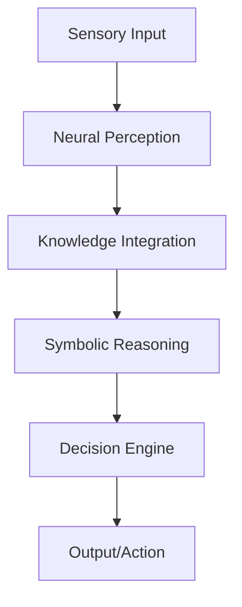

# Cognitive Computing Research


Research-driven implementations of cognitive computing frameworks, focusing on neural-symbolic integration and explainable AI.

## System Architecture



## Business Impact
- **Explainable Decisions:** Provides clear rationales for AI decisions, critical in finance and healthcare.
- **Knowledge Preservation:** Captures and utilizes organizational domain expertise effectively.
- **Complex Problem Solving:** Handles multi-step reasoning tasks beyond standard pattern matching.

## Installation Guide
1. Clone the repository:
   ```bash
   git clone https://github.com/Krishnaandey25/Cognitive-Computing-Research.git
   ```
2. Install dependencies:
   ```bash
   pip install -r requirements.txt
   ```
3. Run the cognitive engine:
   ```bash
   python src/main.py
   ```
